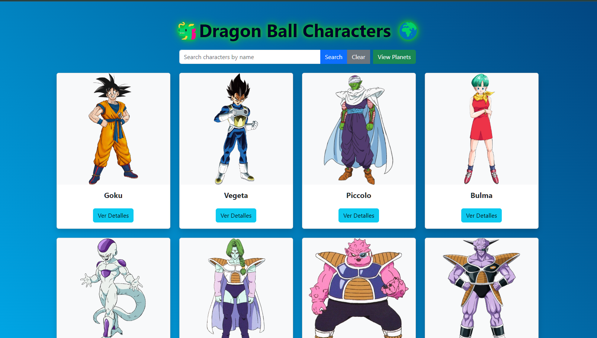
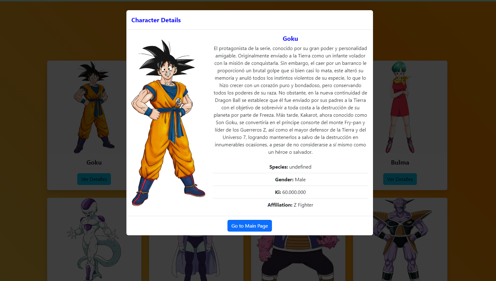
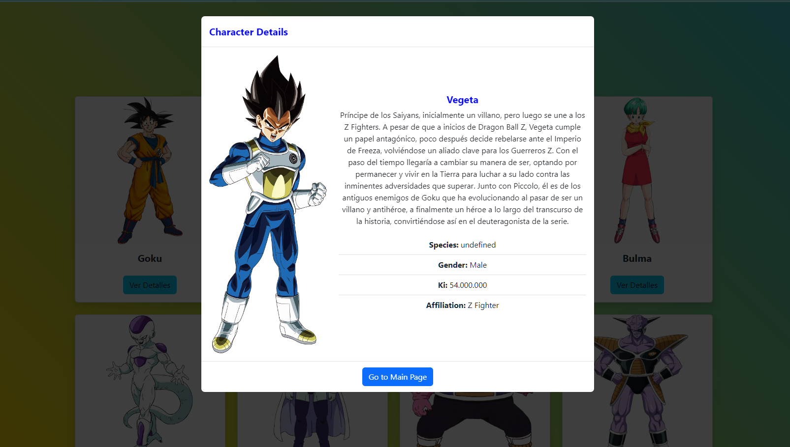
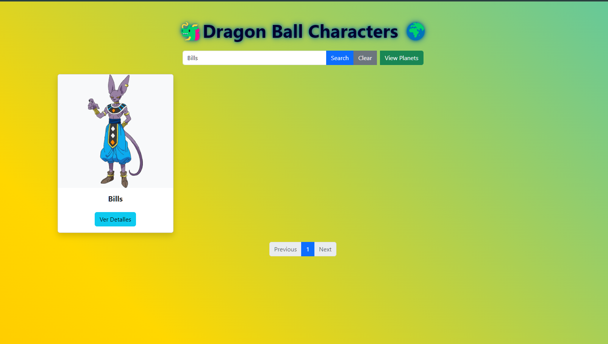
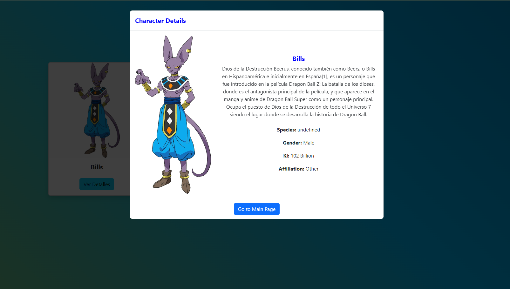
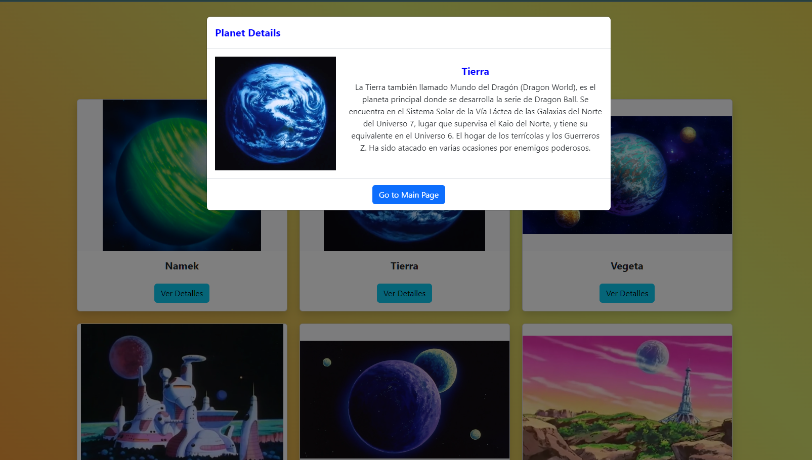

# Dragon Ball Project API Dragon Ball Z en React

Este proyecto muestra información sobre los personajes y planetas del universo Dragon Ball. Está diseñado con React (HTML, CSS y JavaScript) utilizando Bootstrap para el estilo y la funcionalidad de los modales y paginación.

## API de Dragon Ball

El proyecto utiliza la Dragon Ball API, una API pública que proporciona datos detallados sobre personajes, planetas, y más del universo Dragon Ball. Esta API es una excelente herramienta para acceder a información rica y variada, lo que permite integrar contenido relevante y actualizado en tus aplicaciones y proyectos.

### Recursos Disponibles en la API

La API de Dragon Ball ofrece los siguientes recursos:

- **Personajes**: Información sobre los personajes principales y secundarios, incluyendo detalles como nombre, imagen, descripción, y atributos específicos.
- **Planetas**: Datos sobre los planetas del universo Dragon Ball, con información visual y descriptiva.
- **Otras Entidades**: Dependiendo de la versión de la API, también puede ofrecer información sobre otras entidades relevantes.

### Documentación

Puedes consultar la documentación completa de la API en [Dragon Ball API Documentation](https://dragon-ball-api.com/documentation) para obtener detalles sobre los endpoints disponibles, ejemplos de uso, y parámetros necesarios para realizar solicitudes.

## Creación del Proyecto

Crea un nuevo proyecto de React utilizando Create React App:

```

cd %userprofile%\Desktop

npx create-react-app dragon-ball-project

Asegúrate de tener react-router-dom instalado:

npm install react-router-dom
```


Reemplaza el contenido generado automáticamente con los archivos y código proporcionado.

## Estructura del Proyecto

El proyecto tendrá la siguiente estructura:

```
dragon-ball-project
│
├── public
│   └── index.html
├── src
│   ├── components
│   │   ├── CharacterCard.js
│   │   ├── CharacterModal.js
│   │   ├── PlanetCard.js
│   │   ├── PlanetModal.js
│   │   └── Pagination.js
│   ├── pages
│   │   ├── Characters.js
│   │   └── Planets.js
│   ├── App.js
│   ├── index.js
│   └── styles.css
└── package.json
```

## URL del Proyecto Desplegado:

https://dragon-ball-project-react.vercel.app/


## Galería

| Imagen 1 | Imagen 2 | Imagen 3 |
|:---------:|:---------:|:---------:|
|  |  |  |
| Portada 1 | Portada 2 | Portada 3 |

| Imagen 4 | Imagen 5 | Imagen 6 |
|:---------:|:---------:|:---------:|
|  |  |  |
| Portada 4 | Portada 5 | Portada 6 |


## Scripts Disponibles

En el directorio del proyecto, puedes ejecutar:

### `npm start`

Ejecuta la aplicación en modo de desarrollo.
Abre [http://localhost:3000](http://localhost:3000) para verla en tu navegador.

La página se recargará cuando hagas cambios.
También puedes ver errores de lint en la consola.

### `npm test`

Inicia el ejecutor de pruebas en modo interactivo.
Consulta la sección sobre [ejecutar pruebas](https://facebook.github.io/create-react-app/docs/running-tests) para más información.

### `npm run build`

Construye la aplicación para producción en la carpeta `build`.
Empaqueta React correctamente en modo de producción y optimiza la construcción para obtener el mejor rendimiento.

La construcción se minifica y los nombres de archivo incluyen los hashes.
¡Tu aplicación está lista para ser desplegada!

Consulta la sección sobre [despliegue](https://facebook.github.io/create-react-app/docs/deployment) para más información.

### `npm run eject`

**Nota: esta es una operación de un solo sentido. Una vez que 'ejectas', ¡no puedes volver atrás!**

Si no estás satisfecho con la herramienta de construcción y las opciones de configuración, puedes 'eyectar' en cualquier momento. Este comando removerá la única dependencia de construcción de tu proyecto.

En su lugar, copiará todos los archivos de configuración y las dependencias transitivas (webpack, Babel, ESLint, etc.) directamente en tu proyecto para que tengas control total sobre ellos. Todos los comandos excepto `eject` seguirán funcionando, pero apuntarán a los scripts copiados para que puedas ajustarlos. En este punto, estás por tu cuenta.

No tienes que usar `eject` nunca. El conjunto de funciones seleccionadas es adecuado para despliegues pequeños y medianos, y no deberías sentirte obligado a usar esta función. Sin embargo, entendemos que esta herramienta no sería útil si no pudieras personalizarla cuando estés listo para ello.

## Aprende Más

Puedes aprender más en la [documentación de Create React App](https://facebook.github.io/create-react-app/docs/getting-started).

Para aprender React, consulta la [documentación de React](https://reactjs.org/).

### División del Código

Esta sección se ha movido aquí: [https://facebook.github.io/create-react-app/docs/code-splitting](https://facebook.github.io/create-react-app/docs/code-splitting)

### Analizando el Tamaño del Paquete

Esta sección se ha movido aquí: [https://facebook.github.io/create-react-app/docs/analyzing-the-bundle-size](https://facebook.github.io/create-react-app/docs/analyzing-the-bundle-size)

### Creando una Aplicación Web Progresiva

Esta sección se ha movido aquí: [https://facebook.github.io/create-react-app/docs/making-a-progressive-web-app](https://facebook.github.io/create-react-app/docs/making-a-progressive-web-app)

### Configuración Avanzada

Esta sección se ha movido aquí: [https://facebook.github.io/create-react-app/docs/advanced-configuration](https://facebook.github.io/create-react-app/docs/advanced-configuration)

### Despliegue

Esta sección se ha movido aquí: [https://facebook.github.io/create-react-app/docs/deployment](https://facebook.github.io/create-react-app/docs/deployment)

### `npm run build` falla al minificar

Esta sección se ha movido aquí: [https://facebook.github.io/create-react-app/docs/troubleshooting#npm-run-build-fails-to-minify](https://facebook.github.io/create-react-app/docs/troubleshooting#npm-run-build-fails-to-minify)


# 🐉 Dragon Ball Project API Tutorial 🌟

## 📖 Introduction

Welcome to the Dragon Ball Project API tutorial! This guide will walk you through creating an exciting web application that brings the vast and colorful world of Dragon Ball to life. Whether you're a die-hard fan of the series or just getting started with web development, this project offers a fun and engaging way to improve your React skills while exploring the Dragon Ball universe.

Our application will utilize the Dragon Ball API to display information about characters and planets from the series. You'll learn how to fetch data from an API, create interactive components, implement search functionality, and more – all within the context of Goku's adventures and the rich lore of Dragon Ball.

## 🚀 Project Overview

The Dragon Ball Project API is a React-based web application that showcases characters and planets from the Dragon Ball universe. It features:

- 👥 A character gallery with detailed information
- 🌍 A planet explorer with descriptions and status
- 🔍 Search functionality for both characters and planets
- 📄 Pagination for easy navigation through large datasets
- 🖼️ Modal pop-ups for in-depth information on each character and planet

By the end of this tutorial, you'll have a fully functional web application that any Dragon Ball fan would love to explore!

## 🛠️ Prerequisites

Before we begin our journey, make sure you have the following installed:

- Node.js (version 12 or higher)
- npm (usually comes with Node.js)
- A code editor of your choice (we recommend Visual Studio Code)
- Basic knowledge of HTML, CSS, and JavaScript
- Familiarity with React fundamentals

## 🏗️ Project Setup

Let's start by creating our project and setting up the necessary files:

1. Open your terminal and navigate to the directory where you want to create your project.

2. Run the following command to create a new React application:

   ```
   npx create-react-app dragon-ball-project
   ```

3. Once the project is created, navigate into the project directory:

   ```
   cd dragon-ball-project
   ```

4. Install the additional dependencies we'll need for this project:

   ```
   npm install react-router-dom bootstrap
   ```

5. Replace the contents of the `src` folder with the files provided in this tutorial.

6. Update the `public/index.html` file with the provided content to include Bootstrap CSS and JS.

## 📁 Project Structure

Our project will have the following structure:

```
dragon-ball-project
│
├── public
│   └── index.html
├── src
│   ├── components
│   │   ├── CharacterCard.js
│   │   ├── CharacterModal.js
│   │   ├── PlanetCard.js
│   │   ├── PlanetModal.js
│   │   └── Pagination.js
│   ├── pages
│   │   ├── Characters.js
│   │   └── Planets.js
│   ├── App.js
│   ├── index.js
│   └── styles.css
└── package.json
```

## 🧩 Component Breakdown

Let's break down the main components of our application:

1. **CharacterCard & PlanetCard**: These components display individual characters and planets in a card format.
2. **CharacterModal & PlanetModal**: These provide detailed information about a character or planet when clicked.
3. **Pagination**: This component handles navigation through multiple pages of results.
4. **Characters & Planets pages**: These are the main views for browsing characters and planets.

## 🔧 Implementation Steps

We'll go through the implementation in the following order:

1. Set up the base application structure (App.js and routing)
2. Create the Characters page with API integration
3. Implement the CharacterCard and CharacterModal components
4. Create the Planets page following a similar pattern
5. Implement the PlanetCard and PlanetModal components
6. Add the Pagination component for both pages
7. Style the application using Bootstrap and custom CSS

## 🎨 Styling Your Application

We're using Bootstrap for the base styling of our application. The `styles.css` file contains additional custom styles for the modals and other components. Feel free to adjust these styles to match your preferences or to make the application feel more "Dragon Ball"-like!

## 🚀 Running Your Application

To start your Dragon Ball Project API application, run the following command in your project directory:

```
npm start
```

This will launch the application in development mode. Open [http://localhost:3000](http://localhost:3000) to view it in your browser.

## 🌟 Enhancing Your Project

Here are some ideas to take your Dragon Ball Project API to the next level:

1. **Add a Battle Simulator**: Create a feature where users can select characters and simulate battles based on their power levels.
2. **Implement User Authentication**: Allow users to create accounts and save their favorite characters and planets.
3. **Create a Timeline**: Develop an interactive timeline of major events in the Dragon Ball series.
4. **Add Soundtracks**: Incorporate iconic Dragon Ball soundtracks to play in the background while browsing.
5. **Implement Data Visualization**: Create charts and graphs to visualize character power levels, planet sizes, etc.

## 🐞 Troubleshooting

If you encounter any issues while setting up or running your project, try the following steps:

1. Ensure all dependencies are correctly installed by running `npm install` again.
2. Check that you're using a compatible version of Node.js.
3. Clear your browser cache and restart the development server.
4. Double-check that all file paths in your imports are correct.

If problems persist, refer to the React documentation or seek help in React community forums.

## 🎉 Conclusion

Congratulations! You've now created a fantastic Dragon Ball-themed web application using React and the Dragon Ball API. This project has helped you practice important concepts like working with APIs, state management, and creating reusable components.

Remember, the journey of a developer is much like Goku's path to becoming the strongest warrior – it takes practice, persistence, and a willingness to learn. Keep exploring, keep coding, and who knows? Your next project might just go Super Saiyan!

May your code be as powerful as a Kamehameha and as bug-free as Shenron's wish-granting! Happy coding! 🐉✨
